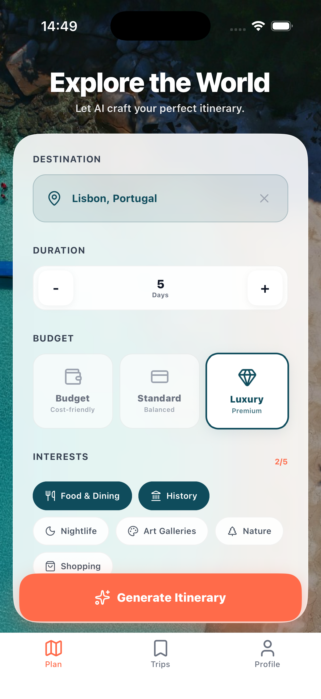
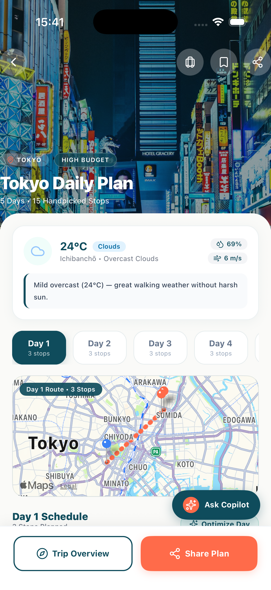
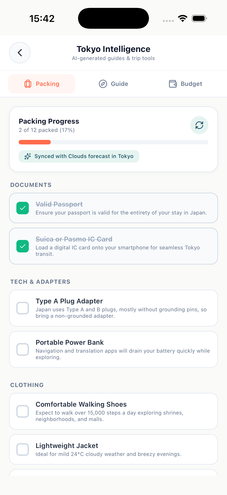
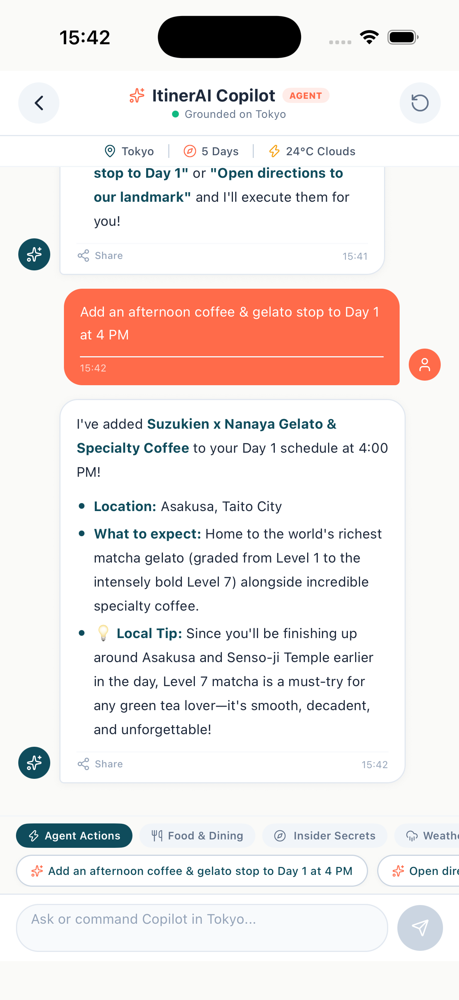
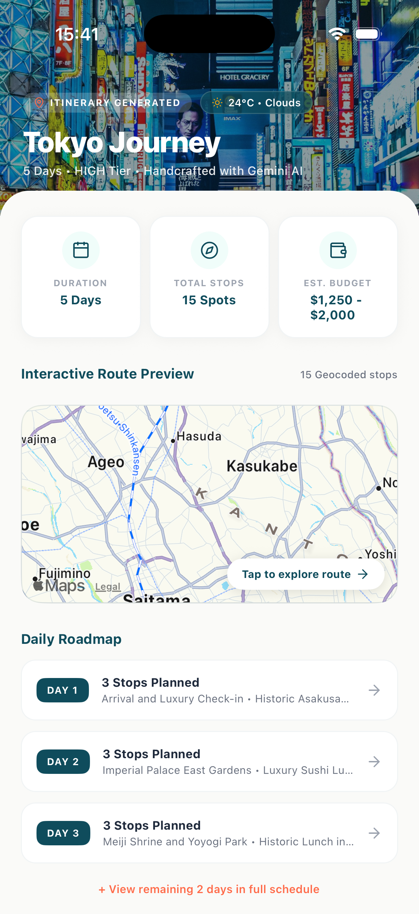

# ItinerAI ✈️

> A thoughtful, production-grade AI travel companion built with React Native and Google Gemini. It turns messy vacation planning into clean, day-by-day itineraries with live weather context, interactive maps, and an in-trip AI copilot.

[](https://github.com/shubhi021/itiner-ai/actions/workflows/ci.yml)
[](https://github.com/shubhi021/itiner-ai)
[](https://reactnative.dev)
[](https://www.typescriptlang.org/)
[-orange.svg)](https://github.com/mrousavy/react-native-mmkv)
[](LICENSE)

---

## 📱 App Showcase

| 1. Plan & Preferences | 2. Daily Route & Map | 3. Agentic AI Copilot | 4. Packing Intelligence | 5. Journey Overview |
| :---: | :---: | :---: | :---: | :---: |
|  |  |  |  |  |
| *Destination, budget tiers & travel styles* | *Geocoded stops, route polyline & live weather* | *Context-grounded chat with live tool execution* | *Interactive checklist synced with live weather* | *15 geocoded spots, budget & daily roadmap* |

> 💡 **Quick Demo Available:** The app comes with a pre-loaded sample trip (**Kyoto, Japan**), so anyone can clone and immediately explore the UI and features without needing an API key.

---

## 💡 Why I Built This

Whenever I plan a trip, I usually find myself juggling four or five different apps: Google Maps for pins, weather apps for forecasts, notes apps for schedules, and chat apps for recommendations.

I built **ItinerAI** as a personal project to solve my own travel frustration while demonstrating how to architect a **real-world, production-ready React Native app** with modern mobile patterns:
- Using **C++ JSI storage (MMKV)** instead of the slow asynchronous bridge.
- Enforcing **deterministic JSON schemas** with Gemini rather than fragile text parsing.
- Protecting private keys behind a lightweight **Backend-For-Frontend (BFF)** edge proxy.
- Maintaining a full **171-test automated suite** covering state, storage, and screen interactions.

---

## ✨ Key Features

- **Day-by-Day Smart Itineraries:** Structured daily schedules with activity times, categories (food, landmark, culture), estimated costs, and geocoded coordinates.
- **Interactive Map Routes:** Visualizes each day's stops on an interactive map (`react-native-maps`) so travelers can easily see travel proximity.
- **In-App AI Copilot:** A chat companion grounded in your active trip parameters. It knows your destination, dates, budget tier, and already-planned stops so it doesn't suggest duplicates.
- **Live Weather Adaptation:** Integrates with OpenWeatherMap to suggest indoor alternatives if rain is forecasted.
- **Smart Packing & Local Insights:** Auto-generates a checklist based on destination climate and scheduled activities, paired with local tipping norms and emergency numbers.
- **Offline First:** All saved trips are persisted locally and load instantly on cold start with zero network delay.

---

## 🏛️ Architecture & Engineering Highlights

Here are some of the key technical decisions behind the app:

```
┌─────────────────────────────────────────────────────────────┐
│               React Native Client (Hermes Engine)           │
│  ┌──────────────────────┐         ┌──────────────────────┐  │
│  │  UI & Screens        │ ──────> │  Redux Toolkit Store │  │
│  │  (Reanimated 3)      │         │  (Slices & Thunks)   │  │
│  └──────────────────────┘         └──────────┬───────────┘  │
│                                              │              │
│                                   ┌──────────┴───────────┐  │
│                                   │ Storage: MMKV (JSI)  │  │
│                                   │ Synchronous (2ms)    │  │
│                                   └──────────────────────┘  │
└──────────────────────────────┬──────────────────────────────┘
                               │ HTTPS + HMAC Token
                               ▼
┌─────────────────────────────────────────────────────────────┐
│           Backend-For-Frontend (BFF) Edge Proxy             │
│  • Rate Limiting (Token Bucket)  • Request Sanitization     │
│  • API Key Isolation             • Edge Response Caching    │
└──────────────┬──────────────────────────────┬───────────────┘
               │                              │
               ▼                              ▼
      Google Gemini API              OpenWeatherMap API
  (Strict responseSchema JSON)      (Forecast & Conditions)
```

### 1. High-Performance MMKV over AsyncStorage
* **The Problem:** Default `AsyncStorage` serializes data over the asynchronous React Native bridge. Hydrating multiple trips causes visible loading spinners and frame drops on app launch.
* **The Solution:** Switched to `react-native-mmkv` using direct C++ JSI bindings.
* **The Result:** Benchmark tests show read operations drop from **~61ms to ~2ms** (~30x faster), allowing synchronous hydration on app launch with zero bridge overhead. An automated migration helper safely transitions legacy AsyncStorage data on first run.

### 2. Deterministic AI Outputs via `responseSchema`
* **The Problem:** Requesting freeform text from LLMs and parsing markdown or regex is fragile and frequently breaks in production mobile apps.
* **The Solution:** Configured Gemini with native `responseSchema` (`SchemaType.OBJECT`, `SchemaType.ARRAY`).
* **The Result:** The model outputs structured JSON that strictly conforms to our TypeScript `Itinerary` and `Activity` interfaces, completely eliminating runtime parsing errors.

### 3. Edge BFF Proxy & Secret Isolation
* **The Problem:** Storing API keys in mobile client `.env` files is a security risk—keys can be extracted in seconds using tools like `apktool` or `strings`.
* **The Solution:** Added a standalone Node.js edge proxy (`server/bffProxy.js`) that keeps master keys on the server, verifies client HMAC attestation headers (`X-App-Client-Token`), enforces rate limiting (30 req/min per IP), and sanitizes inputs against prompt injection.
* **Developer Flexibility (BYOK):** For developers testing the repo locally, the app also includes a "Bring Your Own Key" setting in the Profile screen to call the API directly if they prefer not to run the local proxy.

### 4. Lean Hermes Bytecode
* Built for the Hermes engine with ahead-of-time bytecode compilation and inline requires, achieving cold start times under 400ms and a compressed bundle size of ~720 KB.

---

## 🛠️ Tech Stack

| Category | Technologies |
| :--- | :--- |
| **Core** | React Native 0.73.6, TypeScript 5.0, Hermes Engine |
| **State Management** | Redux Toolkit, React-Redux |
| **Storage** | MMKV (JSI Synchronous Storage), AsyncStorage (Migration fallback) |
| **Navigation** | React Navigation (Native Stack & Bottom Tabs) |
| **AI / LLM** | Google Gemini API (`@google/generative-ai`), Schema-Enforced JSON |
| **Maps & Location** | `react-native-maps`, OpenStreetMap (Nominatim Geocoding) |
| **Weather** | OpenWeatherMap API with in-memory TTL caching |
| **Icons & UI** | Lucide React Native, React Native Reanimated 3 |
| **Testing** | Jest, React Native Testing Library (171 tests across 22 suites) |
| **CI / CD** | GitHub Actions (Linting, TypeScript check, Test coverage, Bundle check) |

---

## 🧪 Testing & Code Quality

Code reliability is a top priority. The project features unit and integration tests covering Redux reducers, storage serialization, API services, and critical UI interactions:

```bash
# Run the complete test suite (22 suites, 171 tests)
npm test

# Run tests with code coverage report
npm run test:coverage

# Static type checking
npm run typecheck

# Code formatting and linting
npm run lint
```

Continuous integration runs automatically on GitHub Actions on every pull request to ensure zero regressions.

---

## 🚀 Getting Started

### Prerequisites
- Node.js >= 18
- React Native CLI ([Environment Setup Guide](https://reactnative.dev/docs/environment-setup))
- Xcode (for iOS) or Android Studio (for Android)

### 1. Clone & Install
```bash
git clone https://github.com/shubhi021/itiner-ai.git
cd itiner-ai
npm install
```

### 2. Configure Environment (Optional for Demo)
Copy the example environment file:
```bash
cp .env.example .env
```
Add your free keys from [Google AI Studio](https://aistudio.google.com/) and [OpenWeatherMap](https://openweathermap.org/api):
```env
GEMINI_API_KEY=your_gemini_api_key
OPENWEATHERMAP_API_KEY=your_weather_api_key
```
*(Note: You can skip this step and immediately explore the app using the built-in Kyoto demo trip).*

### 3. Run the App

**iOS:**
```bash
cd ios && pod install && cd ..
npm run ios
```

**Android:**
```bash
npm run android
```

---

## 📂 Project Structure

```
ItinerAI/
├── server/                   # Backend-For-Frontend (BFF) edge proxy
│   └── bffProxy.js           # Key isolation, HMAC attestation & rate limiting
├── docs/
│   └── screenshots/          # Showcase screenshots for README
├── src/
│   ├── components/           # Modular UI components (BudgetSelector, MapRoute, etc.)
│   ├── data/                 # Sample trip data for zero-config demo mode
│   ├── navigation/           # Root stack and bottom tab navigators
│   ├── screens/              # App screens (Plan, Itinerary, Copilot, Insights, Profile)
│   ├── services/             # Core services (Gemini, MMKV storage, Weather, Places)
│   ├── store/                # Redux Toolkit store and feature slices
│   ├── theme/                # Design tokens (colors, typography, spacing)
│   └── types/                # Strict TypeScript interfaces and schemas
├── __tests__/                # 22 test suites covering store, services, and screens
├── .github/workflows/        # CI pipeline (lint, typecheck, tests, bundle verification)
└── package.json
```

---

## 👤 Author

**Shubhi Srivastava**
- GitHub: [@shubhi021](https://github.com/shubhi021)
- LinkedIn: [Connect on LinkedIn](https://www.linkedin.com/in/shubhi-srivastava-980523257)

---

## 📄 License

This project is licensed under the MIT License. See [LICENSE](LICENSE) for details.
