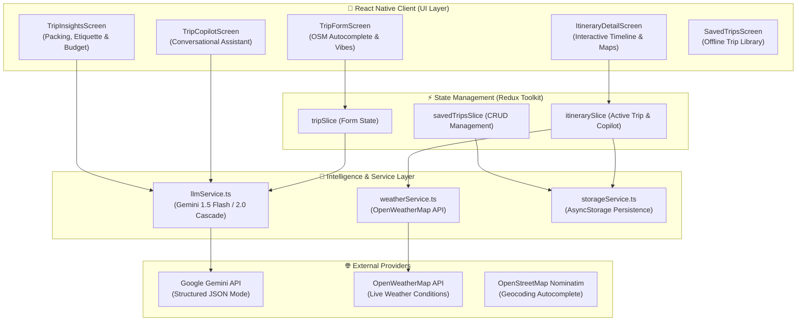

# ItinerAI ✈️

> **Next-Generation LLM-Integrated Travel Itinerary & Smart Copilot Application built with React Native & Google Gemini.**

[](https://reactnative.dev)
[](https://www.typescriptlang.org/)
[](https://ai.google.dev/)
[](https://redux-toolkit.js.org/)
[](https://github.com/react-native-async-storage/async-storage)

---

## 🌟 Overview

**ItinerAI** is a production-grade, offline-resilient mobile application that demonstrates cutting-edge **Large Language Model (LLM) integration patterns in React Native**.

Unlike simple wrapper apps that merely dump raw text prompts into a chat window, ItinerAI treats the LLM as an **intelligent structured travel architect and real-time copilot**:
- Enforces strict **Structured JSON Mode** for multi-day itineraries, coordinates, and activity cards.
- Integrates a **Real-Time Context Engine** injecting live weather forecasts into prompt engineering.
- Powers a **Grounded Conversational Travel Copilot** aware of the traveler's active itinerary, budget, and local constraints.
- Features **Prompt-to-Edit Day Optimization** allowing travelers to re-plan full days using natural language presets (*Relaxed*, *Foodie Tour*, *Efficient Transit*, *Rainy Day Protocol*).
- Delivers an **AI Trip Intelligence Suite** with weather-adaptive packing checklists, cultural etiquette guides, and itemized budget projections.
- Fully operational in **offline environments** (airports, subways, flights) with persistent caching.

---

## 🏗️ System Architecture



---

## 🚀 Advanced LLM Engineering Patterns

### 1. Strict Structured JSON Mode (`responseSchema`)
Rather than relying on fragile regex post-processing or markdown fences, ItinerAI utilizes Google Gemini's native `responseSchema` with typed `SchemaType` definitions:
- **Full Itinerary Schema**: Enforces an exact schema returning days, ordered activity times, categories, locations, and geocoordinates (`latitude` / `longitude`) for map plotting.
- **Single Activity Pivot Schema**: Returns single replacement activity objects when swapping stops.
- **Day Re-Optimization Schema**: Re-plans full day schedules while strictly guaranteeing valid activity structures.
- **Trip Intelligence Schemas**: Strongly typed outputs for packing checklists, cultural etiquette, and itemized financial projections.

```typescript
// Example: Strict Schema Enforcement for Day Re-Optimization
const dayActivitiesSchema: Schema = {
  type: SchemaType.ARRAY,
  items: {
    type: SchemaType.OBJECT,
    properties: {
      time: { type: SchemaType.STRING },
      name: { type: SchemaType.STRING },
      description: { type: SchemaType.STRING },
      location: { type: SchemaType.STRING },
      coordinates: {
        type: SchemaType.OBJECT,
        properties: {
          latitude: { type: SchemaType.NUMBER },
          longitude: { type: SchemaType.NUMBER },
        },
        required: ['latitude', 'longitude'],
      },
      estimatedCost: { type: SchemaType.STRING },
      category: {
        type: SchemaType.STRING,
        format: 'enum',
        enum: ['food', 'landmark', 'nature', 'nightlife', 'shopping', 'other'],
      },
    },
    required: ['time', 'name', 'description', 'location', 'category', 'coordinates'],
  },
};
```

### 2. In-Context Grounding & Prompt Engineering
The AI Travel Copilot receives dynamically assembled system instructions grounding every response in real-world trip parameters:
- **Active Destination & Duration**: Avoids hallucinating out-of-town suggestions.
- **Live Weather Context**: Injects current conditions (e.g. *"Heavy Rain, 14°C"*) to prioritize indoor alternatives.
- **Trip Budget Tier & Group Composition**: Tailors recommendations to budget tier (`low`, `mid`, `high`) and travel style (solo, couple, family, friends).
- **Scheduled Timeline**: Avoids recommending attractions already planned on other days.

### 3. Prompt-to-Edit: Full-Day AI Re-Optimizer
Travelers can transform an entire day's schedule via curated presets or natural language guidance:
- **Relaxed & Leisurely**: Reduces stops to 2-3 unhurried highlights with leisurely cafe pacing.
- **Food & Culinary Focus**: Swaps generic sights for famous artisan markets, historic bakeries, and dinner gems.
- **Efficient Transit**: Geographically clusters stops to minimize walking and transit time.
- **Rainy Day Protocol**: Automatically migrates outdoor activities into covered arcades, museums, and indoor food halls.
- **Custom Instructions**: Freeform user prompt guidance (*"Include a scenic sunset viewpoint before dinner"*).

### 4. Multi-Model Resilience & Fallback Cascade
To safeguard against rate spikes, model migrations, or transient network failures, ItinerAI implements an automated fallback cascade:
`gemini-1.5-flash` ➡️ `gemini-2.0-flash` ➡️ `gemini-1.5-pro` ➡️ `gemini-flash-latest`.

### 5. Offline-First Resilience & Storage Hydration
- **Persistent Storage**: Itineraries, user bookmarks, chat history, and packing lists are serialized with `@react-native-async-storage/async-storage`.
- **TTL Weather Caching**: Cached weather forecasts persist for 1 hour to reduce API hits.
- **Airplane-Ready Packing & Guides**: Checklists remain interactive and checkable offline so travelers can pack and navigate with zero cellular connectivity.

---

## ✨ Features

| Feature | Description |
| :--- | :--- |
| 🤖 **ItinerAI Copilot** | Multi-turn conversational travel assistant with 1-tap suggestion chips and markdown text rendering. |
| 🔄 **Activity Pivot / Swap** | 1-tap context-aware activity replacement with reason selector (Indoor, Budget, Relaxed, Foodie, Surprise). |
| ⚡ **Prompt-to-Edit Re-Planner** | Natural language full-day schedule restructuring with optimistic state updates. |
| 🎒 **Smart Packing Checklist** | AI-generated checklist adapted to weather forecast and scheduled activity categories with persistent checkboxes. |
| 🧭 **Cultural & Survival Guide** | Destination briefing covering tipping customs, transit hacks, cultural dos & don'ts, phrases, and emergency contacts. |
| 💰 **Budget & Expense Forecast** | Itemized cost projections with visual category percentage bars and local saving hacks. |
| 🗺️ **Interactive Route Maps** | Geocoordinates rendered on interactive maps with chronological timeline connectors. |
| 💾 **Offline Saved Trips Library** | Searchable, filterable trip manager with status toggling (`UPCOMING` / `COMPLETED`) and native sharing. |

---

## 🛠️ Tech Stack

- **Framework**: React Native 0.73.6 (CLI)
- **Language**: TypeScript 5.0.4
- **LLM Engine**: Google Generative AI SDK (`@google/generative-ai`)
- **State Management**: Redux Toolkit (`@reduxjs/toolkit` & `react-redux`)
- **Offline Storage**: `@react-native-async-storage/async-storage`
- **Navigation**: React Navigation (Native Stack & Bottom Tabs)
- **Maps**: `react-native-maps`
- **Icons**: `lucide-react-native` & `react-native-svg`
- **Geocoding**: OpenStreetMap Nominatim API

---

## 📁 Project Structure

```
ItinerAI/
├── src/
│   ├── components/       # Reusable UI components (MapRoute, BudgetSelector, etc.)
│   ├── navigation/       # RootNavigator & typed navigation parameters
│   ├── screens/          # Application screens
│   │   ├── SplashScreen.tsx
│   │   ├── OnboardingScreen.tsx
│   │   ├── TripFormScreen.tsx
│   │   ├── LoadingScreen.tsx
│   │   ├── ItineraryDetailScreen.tsx  # Interactive day timeline & map preview
│   │   ├── TripCopilotScreen.tsx      # Conversational grounded travel concierge
│   │   ├── TripInsightsScreen.tsx     # Packing checklist, cultural guide & budget
│   │   ├── ActivityDetailScreen.tsx   # Stop details & external map directions
│   │   ├── TripSummaryScreen.tsx      # Overview metrics & sharing
│   │   ├── SavedTripsScreen.tsx       # Offline trip manager & search
│   │   └── ProfileScreen.tsx          # Traveler style & preferences
│   ├── services/         # Core business logic & API services
│   │   ├── llmService.ts              # Gemini API integrations & structured schemas
│   │   ├── weatherService.ts          # OpenWeatherMap API & weather tips
│   │   ├── storageService.ts          # AsyncStorage persistence layer
│   │   └── placesService.ts           # OSM city autocomplete
│   ├── store/            # Redux slices
│   │   ├── index.ts
│   │   ├── itinerarySlice.ts          # Active itinerary, copilot & insights
│   │   ├── savedTripsSlice.ts         # Saved trips library
│   │   └── tripSlice.ts               # Trip creation form state
│   ├── theme/            # Brand color palette & typography tokens
│   ├── types/            # TypeScript interfaces & domain models
│   └── utils/            # Responsive dimensions & formatting helpers
├── App.tsx
├── package.json
└── README.md
```

---

## 🚀 Getting Started

### Prerequisites
- Node.js >= 18
- React Native CLI development environment ([Environment Setup Guide](https://reactnative.dev/docs/environment-setup))
- CocoaPods (for iOS)
- Android Studio / Xcode

### 1. Clone & Install Dependencies
```bash
git clone https://github.com/shubhi021/itiner-ai.git
cd itiner-ai
npm install
```

### 2. Configure Environment Variables
Create a `.env` file in the project root:
```env
GEMINI_API_KEY=your_google_gemini_api_key_here
OPENWEATHERMAP_API_KEY=your_openweathermap_api_key_here
```
> [!TIP]
> You can obtain a free Gemini API key from [Google AI Studio](https://aistudio.google.com/).

### 3. iOS Setup
```bash
cd ios
pod install
cd ..
```

### 4. Run the Application
```bash
# Start Metro bundler
npm start

# Run on iOS Simulator
npm run ios

# Run on Android Emulator
npm run android
```

---

## 📜 License
Distributed under the MIT License. See `LICENSE` for more information.
